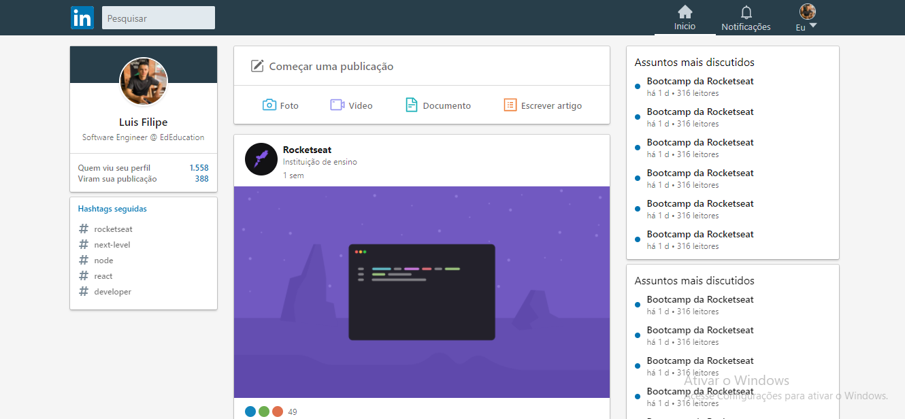
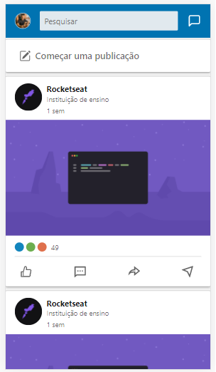

<h1 align="center">
    UiLinkedin
</h1>
 

Interface do Linkedin com o shimmer efect

<h4 align="center">
  Linkedin
</h4>

<h1 align="center">
    
</h1>

Responsivo
<h1 align="center">
    
</h1>

## :rocket: Tecnologias

Esse projeto foi desenvolvido com as seguintes tecnologias:

- [Node.js](https://nodejs.org/en/)
- [React](https://reactjs.org)

## 💻 Projeto

App para controle de ações da minha carteira

## 🤔 Como contribuir

- Faça um fork desse repositório;
- Cria uma branch com a sua feature: `git checkout -b minha-feature`;
- Faça commit das suas alterações: `git commit -m 'feat: Minha nova feature'`;
- Faça push para a sua branch: `git push origin minha-feature`.

Depois que o merge da sua pull request for feito, você pode deletar a sua branch.
